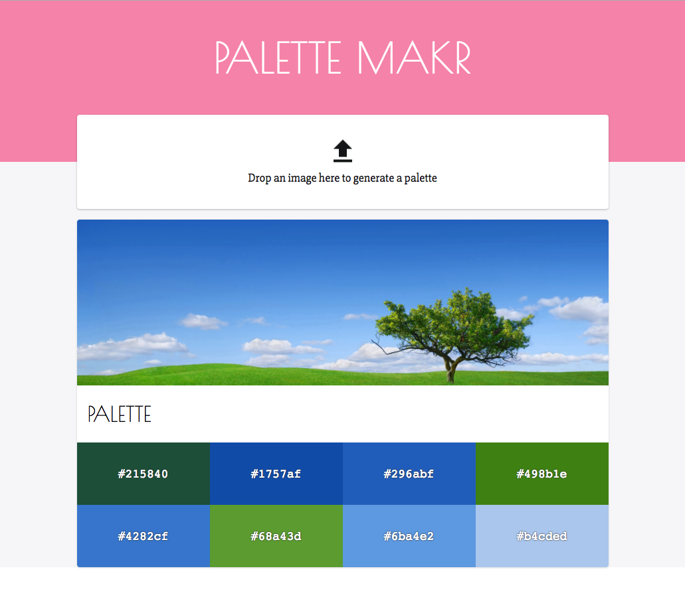

# Palette Makr

> Use pictures to generate beautiful color palettes  🎉



This is yet another tool to generate palettes from pictures, but hey, I was curious about the algorithm used to extract colors. 😜

## Related Articles & Projects

* [Median Cut on Wikipedia](https://en.wikipedia.org/wiki/Median_cut)
* [Building a Media Player by Paul Lewis](https://www.youtube.com/watch?v=P95ZDIzjg0Q) and [the repo](https://github.com/GoogleChrome/sample-media-pwa)
* [How to calculate a complementary Colour](http://serennu.com/colour/rgbtohsl.php)

## Techs & Patterns

* [React](https://facebook.github.io/react/) & [Create React App](https://github.com/facebookincubator/create-react-app)
* [File API](https://developer.mozilla.org/docs/Web/API/File)
* [Web Workers](https://developer.mozilla.org/en-US/docs/Web/API/Web_Workers_API/Using_web_workers)

## Getting started

```shell
# Install dependencies
yarn
# Start the project
yarn start
```